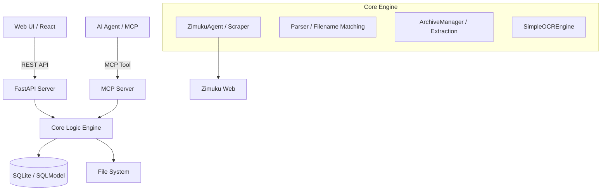

# Zimuku Subtitle Server 架构设计 (Architecture)

本项目是一个独立的字幕管理与刮削服务，支持高效的 TV 剧集精确匹配、自动化媒体库扫描及 MCP 协议集成。

## 1. 系统架构图



## 2. 核心模块与职责

### 2.1 后端模块 (`/app`)
- **`app.core`**: 核心逻辑层
  - **`scraper.py`**: 字幕库 (Zimuku) 爬虫。实现三层递进搜索策略（搜索页 -> 季详情页 -> 兜底模式）及多镜像轮询下载逻辑。
  - **`archive.py`**: 压缩包处理。支持 ZIP/7z 解压，并解决文件名乱码（CP437 -> GBK）。
  - **`ocr.py`**: 验证码识别。内置轻量级像素采样 OCR 引擎。
  - **`config.py`**: 配置管理，支持环境变量与数据库持久化配置。
- **`app.api`**: 表现层 (RESTful)
  - **`media.py`**: 媒体库管理、全自动匹配逻辑、目录扫描。
  - **`search.py`**: 字幕搜索入口，集成 SQLite 缓存。
  - **`tasks.py`**: 异步下载任务管理。
  - **`system.py`**: 系统监控、日志查看及基础状态统计。
- **`app.db`**: 数据持久层
  - **`models.py`**: 定义了 `ScannedFile`, `MediaPath`, `SubtitleTask`, `SearchCache` 等核心模型。
- **`app.mcp`**: 协议集成层
  - **`server.py`**: 实现 Model Context Protocol，将搜索和下载暴露为 AI 可直接调用的 Tools。

### 2.2 前端模块 (`/frontend`)
- **`src/pages`**: 核心页面（搜索、电影、剧集、任务管理、设置）。
- **`src/api.ts`**: Axios 请求封装，定义后端通信接口。

## 3. 数据库设计 (Database Schema)

系统采用 SQLite 和 SQLModel 管理数据存储，核心数据模型定义如下：

### 3.1 核心数据表
- **`Setting`** (系统配置表):
  - `key` (唯一键, 索引), `value` (配置项的值), `description` (说明)
- **`SearchCache`** (搜索结果缓存表):
  - `query` (搜索词, 唯一键), `results_json` (搜索结果列表的 JSON 序列化形式), `expires_at` (过期时间)
- **`SubtitleTask`** (后台异步下载/解压任务表):
  - `title`, `source_url`, `status` (pending / downloading / completed / failed), `save_path` (下载后原始文件存放路径)
- **`MediaPath`** (媒体扫描目录表):
  - `path` (绝对路径), `type` (movie | tv), `enabled` (启停状态), `last_scanned_at` (最后扫描时间)
- **`ScannedFile`** (本地媒体视频文件记录):
  - 记录通过扫描目录获取的本地视频状态：`filename` (原始文件名), `extracted_title` (解析的媒体名称), `season` & `episode` (解析的季集), `has_subtitle` (是否已成功匹配并下载了该视频的字幕), 外键关联 `MediaPath`。

## 4. 关键工作流 (Workflows)

### 4.1 剧集精确匹配流程
1. **三层匹配**：优先匹配 `SxxExx` 格式；若无则进入季页面搜索；最后兜底。
2. **二次过滤**：通过 `_double_filter` 对搜索结果按集数进行二次筛选。
3. **评分算法**：解压出的字幕文件通过 `get_sub_score` 打分。
   - **加分项**：匹配正确的 `SxxExx` (+500)，常用语言关键词。
   - **减分项**：匹配到错误的季号 (-1000)，繁体干扰。

### 4.2 自动下载与归档流程
1. 提取详情页中的真实下载跳转 URL。
2. 轮询所有可用的镜像链接。
3. 下载后进行 `FILE_MIN_SIZE` 校验。
4. 移动至目标存储目录并重命名为视频同名。

## 5. 目录结构指南

```text
/
├── app/
│   ├── api/            # REST API 路由实现
│   ├── core/           # 核心业务逻辑 (爬虫, 解压, OCR)
│   ├── db/              # 数据库模型与会话管理
│   ├── mcp/             # MCP 协议服务器实现
│   └── main.py          # FastAPI 应用入口点
├── frontend/
│   ├── src/
│   │   ├── pages/      # 前端页面组件
│   │   └── api.ts      # 前端 API 调用封装
│   └── tailwind.config.js
├── storage/            # 存储目录 (下载缓存, 临时文件)
├── tests/              # 单元测试与逻辑验证脚本
└── AGENTS.md           # AI 助手开发手册 (包含本文件的链接)
```